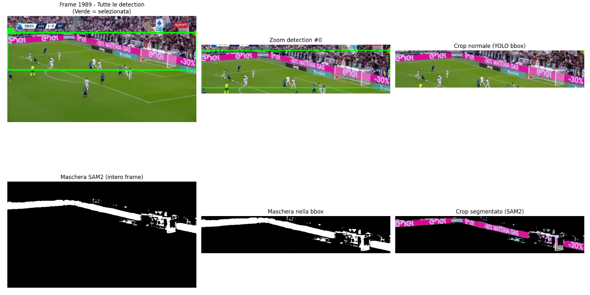

# Deep Learning Project - Football Advertisement Board Detection and Tracking

## Overview
This project implements an advanced computer vision pipeline for detecting, segmenting, and tracking advertisement boards (adboards) in football videos. The system combines multiple state-of-the-art models:

- **YOLO** for object detection
- **ByteTrack** for object tracking
- **SAM2** for precise segmentation
- **CLIP** for content similarity matching

The pipeline processes video frames to identify advertisement boards, track them across frames, generate precise segmentation masks, and assign consistent content IDs based on visual similarity.

## Key Features

- **Multi-Model Pipeline**: Combines detection, tracking, and segmentation
- **Content ID Assignment**: Uses CLIP embeddings to identify similar advertisement content
- **Frame-by-Frame Processing**: Memory-efficient processing for long videos
- **Custom Dataset Creation**: Converts mask annotations to YOLO format
- **Fine-tuning Support**: Includes SAM2 fine-tuning capabilities

## Example Output

The following image shows the complete pipeline in action on a single football frame, demonstrating the progression from YOLO detection to SAM2 segmentation:



*Example showing: (1) Original frame, (2) YOLO bounding box detection, (3) SAM2 precise segmentation with colored masks*

## Project Structure

```
deep-learning-project/
├── README.md                          # This file
├── .gitignore                         # Git ignore rules
├── main-nb.ipynb                      # Main notebook with complete pipeline
├── clipsim.py                        # CLIP similarity and content ID assignment
├── utils.py                          # Utility functions for data processing
├── test.py                           # Test script for mask-to-bbox conversion
├── test_result.png                   # Test output image
├── __pycache__/                      # Python cache files
│   ├── clipsim.cpython-312.pyc
│   ├── utils.cpython-311.pyc
│   └── utils.cpython-312.pyc
├── data/                             # Raw dataset (ignored)
│   ├── Tagged_Images/                # Original football frames
│   └── Masks/                        # Binary masks for advertisement boards
│       ├── mask0.png
│       ├── mask1.png
│       └── ... (1000+ mask files)
├── dataset/                          # YOLO-formatted dataset (ignored)
│   ├── football.yaml                 # YOLO configuration file
│   ├── images/                       # Train/val/test images
│   │   ├── train/
│   │   ├── val/
│   │   └── test/
│   └── labels/                       # YOLO annotation files
│       ├── train/
│       ├── val/
│       └── test/
├── input_videos/                     # Input video files (ignored)
│   ├── video.mp4
│   └── video1.mp4
├── output_videos/                    # Generated output videos (ignored)
│   ├── output.mp4
│   └── output_sam2_framebased.mp4
├── models_pretrained/                # Pre-trained model weights
├── models_trained/                   # Fine-tuned model weights
│   ├── yolo11n/
│   ├── yolov8n/
│   └── yolov8n-aug-bs16/
├── track/                            # Tracking results (ignored)
│   ├── yolo11n/
│   └── yolov8n/
└── sam2/                             # SAM2 model files and checkpoints
```

## Workflow

### 1. Data Preparation
- Convert binary masks to YOLO bounding box annotations
- Split dataset into train/validation/test sets (80/10/10)
- Generate `football.yaml` configuration file

### 2. Object Detection Training
- Fine-tune YOLO models (YOLOv8n, YOLO11n) on football advertisement boards
- Support for data augmentation and batch size optimization
- Model checkpoints saved in `models_trained/`

### 3. Video Processing Pipeline
- **Detection**: YOLO identifies advertisement board locations
- **Tracking**: ByteTrack maintains object identities across frames
- **Segmentation**: SAM2 generates precise masks using YOLO bounding boxes as prompts
- **Content Matching**: CLIP computes visual embeddings for content similarity
- **Visualization**: Generates annotated video with colored masks and content IDs

### 4. Content ID Assignment
The CLIP-based content matching system:
- Extracts visual embeddings from segmented advertisement crops
- Compares new detections against previous embeddings using cosine similarity
- Assigns consistent content IDs to similar advertisements
- Uses moving average to update embeddings over time

## Key Files

- **`main-nb.ipynb`**: Complete pipeline notebook with all processing steps
- **`clipsim.py`**: CLIP-based content similarity matching and ID assignment
- **`utils.py`**: Data processing utilities (mask conversion, SAM2 integration)
- **`test.py`**: Validation script for mask-to-bounding-box conversion

## Dependencies

```bash
# Core ML libraries
pip install torch torchvision torchaudio --index-url https://download.pytorch.org/whl/cu126
pip install ultralytics scipy tqdm opencv-python Pillow

# Specialized models
pip install git+https://github.com/openai/CLIP.git
pip install git+https://github.com/facebookresearch/segment-anything-2.git
pip install huggingface_hub
```

## Usage

1. **Prepare Dataset**: Place images in `data/Tagged_Images/` and masks in `data/Masks/`
2. **Convert to YOLO Format**: Run the mask conversion utility
3. **Train YOLO Model**: Fine-tune on your dataset
4. **Process Videos**: Run the complete pipeline on input videos
5. **Review Results**: Check output videos with tracked and segmented advertisements

## Output

- **Annotated Videos**: Videos with colored bounding boxes and masks
- **Content IDs**: Consistent identification of similar advertisement content
- **Tracking Data**: Frame-by-frame detection and tracking results
- **Model Checkpoints**: Trained weights for future inference

## License


This project is for research and educational purposes. Please ensure compliance with the licenses of the underlying models (YOLO, SAM2, CLIP).
